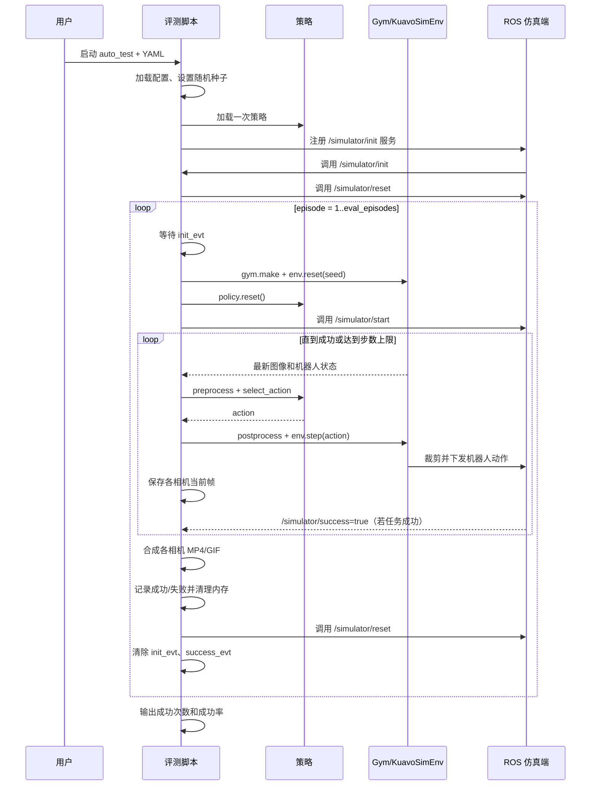

# Kuavo 仿真自动测试流程总结

> 本文根据当前仓库代码整理，可直接复制给网页版 GPT 作为上下文。核心入口为 `kuavo_deploy/src/scripts/script_auto_test.py`，实际评测逻辑位于 `kuavo_deploy/src/eval/sim_auto_test.py`。

## 1. 目标

在 Kuavo ROS 仿真环境中，对一个机器人策略连续执行 `eval_episodes` 个 episode，并统计任务成功次数与成功率，同时保存各相机视角的 rollout 视频和评测日志。

该测试属于 **closed-loop evaluation**：每一步都从 ROS 仿真环境获取最新观测，经策略推理得到动作，再把动作发回机器人环境。

## 2. 系统组成

| 组件 | 作用 |
|---|---|
| 仿真端（`kuavo-ros-opensource`） | 初始化、启动和重置场景；判断任务是否成功 |
| ROS master (`roscore`) | 连接仿真端与评测端 |
| `script_auto_test.py` | 命令行入口、配置加载、暂停/恢复/停止信号处理 |
| `sim_auto_test.py` | 模型加载、episode 循环、成功统计、视频和日志保存 |
| `KuavoSimEnv` / `KuavoBaseRosEnv` | 读取相机和机器人状态、定义动作空间、裁剪并执行动作 |
| 本地策略或 `PolicyClient` | 根据观测生成下一步动作 |

## 3. 启动前提与顺序

需要按以下顺序启动：

1. 启动 ROS master：`roscore`。
2. 启动 `kuavo-ros-opensource` 中配套的自动测试仿真脚本。
3. 如使用远程推理，将策略服务启动在 `localhost:5555`（或修改客户端配置）。
4. 启动本仓库的自动测试：

```bash
python kuavo_deploy/src/scripts/script_auto_test.py \
  --task auto_test \
  --config /path/to/config.yaml
```

也可以通过交互式入口 `bash kuavo_deploy/eval_kuavo.sh`，最终选择自动测试任务。

## 4. 关键配置

配置会先读取基础文件 `configs/deploy/total/deploy_total.yaml`，再用用户传入的 YAML 覆盖。仿真测试至少应确认以下字段：

```yaml
env:
  inference_env: sim
  which_arm: both
  control_mode: joint
  ros_rate: 10
  direct_to_wbc: false
  enable_action_interpolation: true
  control_rate: 100
  obs_key_map:
    head_cam_h: ["/cam_h/color/image_raw/compressed", "CompressedImage", 30, "${env.image_size}"]
    wrist_cam_l: ["/cam_l/color/image_raw/compressed", "CompressedImage", 30, "${env.image_size}"]
    wrist_cam_r: ["/cam_r/color/image_raw/compressed", "CompressedImage", 30, "${env.image_size}"]
    joint_q: ["/sensors_data_raw", "sensorsData", 500]
    rq2f85: ["/gripper/state", "JointState", 500]
  arm_state_keys: ["joint_q", "gripper"]

inference:
  policy_type: act                 # 本地策略；远程推理使用 client
  pretrained_path: /path/to/model # policy_type=client 时不使用
  eval_episodes: 10
  seed: 42
  device: cuda
  max_episode_steps: 200
  task_prompt: "robot manipulation"
```

当 `env.inference_env: sim` 时，配置加载器会强制设置：

- `env_name = Kuavo-Sim`
- `real = false`
- `platform_type = 4pro`
- `eef_type = rq2f85`
- `head_init = [0, 12]`
- `image_size = [640, 480]`

## 5. 策略加载方式

### 本地策略

当 `policy_type != client` 时：

1. 解析 `pretrained_path`；若为空，则拼接旧格式路径 `outputs/train/{task}/{method}/{timestamp}/epoch{epoch}`。
2. 从 LeRobot checkpoint 加载配置和模型权重。
3. 执行 `policy.eval()`、移动到 `device`、`policy.reset()`。
4. 创建与模型配套的 observation preprocessor 和 action postprocessor。
5. 在观测中注入顶层字段 `task`，内容来自 `task_prompt`。

### 远程策略

当 `policy_type: client` 时：

- 创建 `PolicyClient`，默认通过 ZeroMQ 连接 `localhost:5555`。
- 观测与动作不经过本地 pre/postprocessor。
- `task_prompt` 以 `prompt` 字段发给服务端。
- 每次 `policy.reset()` 会尝试调用服务端 `reset` endpoint；旧服务端不支持时会静默兼容。

当前 `sim_auto_test.py` 始终逐步调用 `select_action()`；配置中的 `async_inference` 等异步参数不会在此流程中生效。

## 6. ROS 接口与握手

| 类型 | 名称 | 方向 | 含义 |
|---|---|---|---|
| Service | `/simulator/init` | 仿真端 → 评测端 | 仿真场景已初始化；回调置位 `init_evt` |
| Service | `/simulator/start` | 评测端 → 仿真端 | 当前 episode 已准备好，可以开始仿真 |
| Service | `/simulator/reset` | 评测端 → 仿真端 | 重置场景，准备下一个 episode |
| Topic | `/simulator/success` (`Bool`) | 仿真端 → 评测端 | `true` 时置位 `success_evt`，判定当前 episode 成功 |
| Topic | `/kuavo/pause_state` (`Bool`) | 入口 → 评测循环 | 暂停或恢复动作循环 |
| Topic | `/kuavo/stop_state` (`Bool`) | 入口 → 评测循环 | 提前停止测试 |

控制进程还支持 Unix 信号：

```bash
kill -USR1 <PID>  # 暂停/恢复
kill -USR2 <PID>  # 停止
```

## 7. 完整执行流程



### 单个 episode 的细节

1. 使用 `gym.make("Kuavo-Sim", max_episode_steps=...)` 创建带 `TimeLimit` 的环境。
2. 注册 `/simulator/success` 订阅者。
3. `policy.reset()`，然后执行 `env.reset(seed=seed)`：进入外部控制模式、重置头部、对 10 帧当前状态取平均并获得初始观测。
4. 调用 `/simulator/start`。
5. 从初始观测中找出 key 名包含 `images` 或 `depth` 的相机数据，为每路相机创建临时帧目录。
6. 循环执行：检查暂停/停止 → 注入任务文本 → 预处理 → 策略推理 → 后处理 → 转 NumPy → `env.step()` → 保存相机帧。
7. 环境会检查动作维度和上下界；越界动作会被裁剪。之后按照手臂选择、夹爪类型以及是否 direct-to-WBC，发布实际控制命令。
8. 满足以下任一条件时结束：
   - 收到 `/simulator/success=true`；
   - Gym `TimeLimit` 达到 `max_episode_steps`，返回 `truncated=true`；
   - 收到停止信号。
9. 按 `env.ros_rate` 将各相机 PNG 帧编码为 `rollout_<episode>_<camera>.mp4`；MP4 编码失败时退化为 GIF。
10. 只有 `success_evt` 被置位才返回成功（`1`），超时等情况返回失败（`0`）。

## 8. 跨 episode 循环与统计

- 策略模型只在所有 episode 开始前加载一次。
- 每个 episode 前等待仿真端调用 `/simulator/init`。
- 每个 episode 后再次 `policy.reset()`，执行 Python 垃圾回收并清空 CUDA cache。
- 成功时 `success_count += 1`，并将累计结果追加到日志。
- 随后调用 `/simulator/reset`，清除 `init_evt` 和 `success_evt`，等待下一轮初始化。
- 最终打印：`success_count / eval_episodes` 和成功率。

## 9. 输出产物

输出目录由 `resolve_eval_output_dir(pretrained_path, outputs/eval)` 根据**传入的原始模型路径**决定：

- 如果传入路径的直接父目录名为 `checkpoints`（例如 `<run>/checkpoints/<step>`）：输出到 `outputs/eval/<run_name>/<step>/`。
- 其他模型路径：输出到 `outputs/eval/<传入路径的父目录名>/`。

目录内容包括：

```text
evaluation_autotest.log
rollout_0_<camera>.mp4
rollout_1_<camera>.mp4
...
```

日志当前记录评测时间、计划 episode 数，以及每轮结束后的累计成功数。控制台/运行日志还会记录逐步动作、推理耗时、动作执行耗时、step 总耗时和平均 sleep 时间。

## 10. 成功判定

当前成功判定完全依赖仿真端发布：

```text
/simulator/success = true
```

`KuavoSimEnv.compute_reward()` 固定返回 `0`，基础环境自身的 `step()` 也固定返回 `terminated=false`、`truncated=false`。实际超时由 Gym 的 `TimeLimit(max_episode_steps)` 包装器产生。因此：

- reward 不参与成功判定；
- 达到最大步数只代表 episode 结束，结果仍为失败；
- 必须确保仿真端的成功检测和 `/simulator/success` 发布逻辑可靠。

## 11. 当前实现中值得注意的问题

1. **所有 episode 使用同一个 `seed`**：`env.reset(seed=seed)` 每轮未递增；`start_seed` 当前未被本流程使用。如果希望评估不同场景随机性，需要显式使用 `seed + episode` 或 `start_seed + episode`。
2. **异常会提前终止整批测试**：任一 episode 抛异常后会按失败处理，但随后执行 `break`，不会继续剩余 episode；最终打印的分母仍是配置的 `eval_episodes`。
3. **日志信息有限**：代码没有生成 README 所提到的 `evaluation_autotest.json`，也没有记录逐 episode 的结构化结果、实际完成轮数、失败原因和时长。
4. **初始化等待不完全一致**：首次等待 `/simulator/init` 最多约 8 秒，超时后仍会调用 reset；后续每轮等待没有超时，仿真端不再初始化时会一直阻塞。
5. **`episode_end_time` 已计算但未写入日志**。
6. **异步推理配置不生效**：本流程只使用同步 `select_action()`。
7. **停止路径可能跳过资源清理**：单 episode 内收到停止信号时会直接返回失败，可能不执行该 episode 后半段的视频合成和环境关闭逻辑。
8. **视频写盘开销较大**：每一步先逐帧写 PNG，episode 结束后再全部读回并编码；长 episode、多相机或高分辨率时会占用较多磁盘 I/O 和内存。

## 12. 一句话概括

该流程通过 ROS 与外部 Kuavo 仿真端握手，在 Gym 封装的 `Kuavo-Sim` 环境中反复执行“观测 → 策略推理 → 动作下发”的闭环控制，并以仿真端发布的 `/simulator/success` 为唯一成功信号，在每轮后重置场景，最终输出成功率、日志和多相机 rollout 视频。
